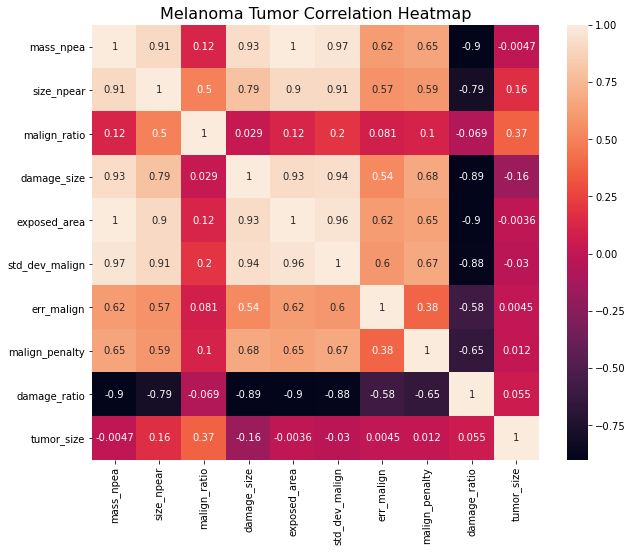
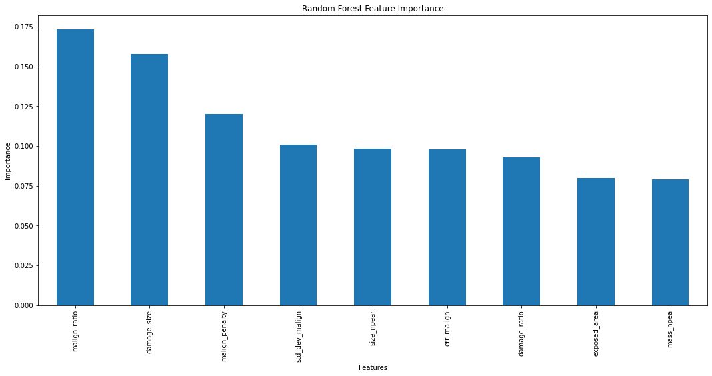

# Melanoma Tumor Size Prediction

Melanoma is skin cancer which evolves from melanocytes, pigment-producing cells. Its primary cause is ultraviolet light exposure in individuals with low level of melanin. It is the most dangerous type of skin cancer. In 2012, the new occurrences were discovered in 232,000 people around the world. In 2015, there were 3.1 million people with active disease, resulting in 59,800 deaths. Melanomas appear in a variety of shapes, sizes, and colors, thus it is a daunting task to provide an accurate diagnosis or prognosis. Tumor size is one of the early signs which could determine the malignancy of tumors. This project aims to predict melanoma tumor sizes based on relevant attributes.

## I. Data
Source: https://www.kaggle.com/anmolkumar/machine-hack-melanoma-tumor-size-prediction

Training Dataset + Test Dataset

## II. Data Wrangling
[Data Wrangling Report](https://github.com/Michael-J-Son/Melanoma_Capstone/blob/main/data_wrangling/Melanoma_Data_Wrangling.ipynb)

__List of Features with Descriptions__
 * mass_npea: the mass of the area under under study for melanoma tumor
 * size_npear: the size of the area under study for melanoma tumor
 * malign_ratio: the ratio of normal to malign surface under study
 * damage_size: irrecoverable area of skin damaged by the tumor
 * exposed area: total area exposed to the tumor
 * stddevmalign: standard deviation of malign skin measurements
 * err_malign: error in malign skin measurements
 * malign_penalty: penalty imposed due to measurement error in the lab
 * damage_ratio: the ratio of damage to total spread on the skin
 * tumor_size: size of melanoma tumor

__Initial Data Exploration__
 * Training Dataset: 9146 entries, 10 columns
 * Target Feature: tumor_size
 * Most correlations between features are due to the inherent proportionality between mass and volume
 * Majority of data points correspond to small tumor sizes
 * Malignancy is prevalent in the current training dataset despite the overwhelming majority of tumor samples being small
 * The left-skewed distributionof damage ratios supports the findings on malignancy

## III. Exploratory Data Analysis
[Exploratory Data Analysis Report](https://github.com/Michael-J-Son/Melanoma_Capstone/blob/main/exploratory_data_analysis/Melanoma_EDA.ipynb)

__Feature Correlations__

__Noteworthy Tumor Size Correlations__
 * size_npear
 * malign_ratio
 * damage_size

## IV. Modeling
[Modeling Report](https://github.com/Michael-J-Son/Melanoma_Capstone/blob/main/modeling/Melanoma_Modeling.ipynb)

__1) Train Validation Split__

__2) Standardize Features__
 * Standardized features using StandardScaler

__3) Model Evaluation__
 * Hyperparameter tuning with Randomized Search
 * R2 and mean squared error as evaluation metrics
 * Performance of the two highest-performing models (Random Forest, Keras Regression) assessed using a separate test dataset
 * Best model: Random Forest, based on the performance evaluation in this project

__Models Assessed:__
 * Multiple Linear Regression
 * Random Forest
 * Support Vector Machine
 * Neural Network: Multi-Layer Perceptron
 * Deep Learning: Keras Regression

