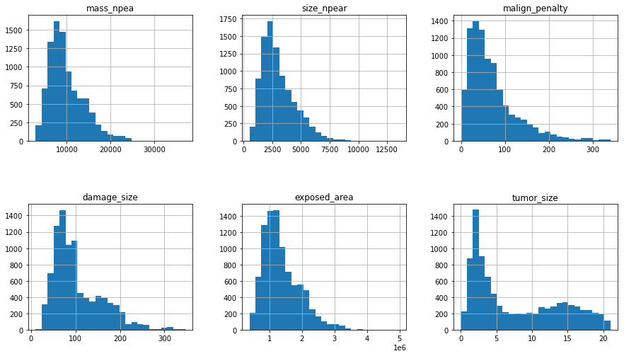
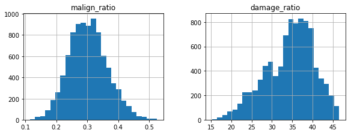
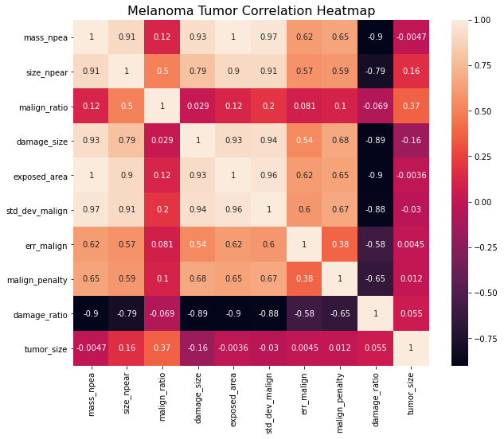

# Melanoma Tumor Size Prediction

Melanoma is skin cancer which evolves from melanocytes, pigment-producing cells. Its primary cause is ultraviolet light exposure in individuals with low level of melanin. It is the most dangerous type of skin cancer. In 2012, the new occurrences were discovered in 232,000 people around the world. In 2015, there were 3.1 million people with active disease, resulting in 59,800 deaths. Melanomas appear in a variety of shapes, sizes, and colors, thus it is a daunting task to provide an accurate diagnosis or prognosis. Tumor size is one of the early signs which could determine the malignancy of tumors. This project aims to predict melanoma tumor sizes based on relevant attributes.

## Data
  * Source: https://www.kaggle.com/anmolkumar/machine-hack-melanoma-tumor-size-prediction
  * Training set: **9,146** entries, **10** features
  * Test set: **36,584** entries, **10** features
  * **0** null values
  * Features
    * **mass_npea**: the mass of the area under study for melanoma tumor.
    * **size_npear**: the size of the area under study for melanoma tumor.
    * **malign_ratio**: the ratio of normal to malign surface under study.
    * **damage_size**: irrecoverable area of skin damaged by the tumor.
    * **exposed_area**: total area exposed to the tumor.
    * **stddevmalign**: standard deviation of malign skin measurements.
    * **err_malign**: error in malign skin measurements.
    * **malign_penalty**: penalty imposed due to measurement error in the lab.
    * **damage_ratio**: the ratio of damage to total spread on the skin.
    * **tumor_size**: size of melanoma tumor.

## Data Wrangling
[Data Wrangling Report](https://github.com/Michael-J-Son/Melanoma_Capstone/blob/main/data_wrangling/Melanoma_Data_Wrangling.ipynb)

### Distribution of Feature Values

  * Most correlations between features likely due to the inherent proportionality between mass and volume.
  * Majority of data points correspond to small tumor sizes.

  * Mean of **malign_ratio** ≈ 0.3, indicating high prevalence of malignancy in the dataset.
  * Left-skewed distribution of **damage_ratio** supports this notion.

## Exploratory Data Analysis
[Exploratory Data Analysis Report](https://github.com/Michael-J-Son/Melanoma_Capstone/blob/main/exploratory_data_analysis/Melanoma_EDA.ipynb)

### Pearson Correlations

  * Notable **tumor_size** correlations

    * **size_npear**
    * **malign_ratio**
    * **damage_size**

## Modeling
[Modeling Report](https://github.com/Michael-J-Son/Melanoma_Capstone/blob/main/modeling/Melanoma_Modeling.ipynb)

### Overview

  * Nature of task

    * Supervised learning
    * Regression to predict numerical value
  * Machine learning tools used

    * **Scikit-Learn**
    * **Keras**

### Procedure

I. Data Preprocessing

1. Training/Validation Split (**70%**: **30%**)
2. Standardization of features with **StandardScaler**.

II. Hyperparameter Tuning with Randomized Search

  * **cv = 3**
  * **n_iter = 50**
  * **scoring = 'neg_mean_squared_error'**

III. Training with Tuned Hyperparameters

IV. Performance Evaluation

  * Evaluation metric

    * **R2**
    * **MSE**
  * Models trained and evaluated

    * **Multiple Linear Regression**
    * **Random Forest**
    * **Support Vector Machine**
    * **Multi-Layer Perceptron**
    * **Keras Regression**

### Model Comparison

| Model                      | MSE   | R2   |
| -------------------------- | ----- | ---- |
| Multiple Linear Regression | 26.43 | 0.29 |
| Random Forest              | 16.21 | 0.57 |
| Support Vector Machine     | 21.53 | 0.42 |
| Multi-Layer Perceptron     | 29.62 | 0.21 |
| Keras Regression           | 18.69 | \-   |

  * High performance model: **Random Forest**, **Keras Regression**

### Performance on Test Set

| Model            | MSE   | R2   |
| ---------------- | ----- | ---- |
| Random Forest    | 8.25  | 0.23 |
| Keras Regression | 12.12 | \-   |

  * Best model: **Random Forest**

### Features of Importance

  * Primary features of importance

    * **malign_ratio**
    * **damage_size**
    * **malign_penalty**

## Assumptions/Limitations

  * Assumption

    * All measurements have been obtained with sufficient accuracy/precision.
  * Limitations

    * Insufficient number of entries for training set compared to those of test set.
    * Low number of features.

## Conclusion

  * Best model: **Random Forest**
  * Primary features of importance: **malign_ratio**, **damage_size**, **malign_penalty**
  * Prospective improvements

    * Larger dataset
    * Hyperparameter tuning with different techniques
    * Further experiment with **Neural Network**/**Deep Learning** models
